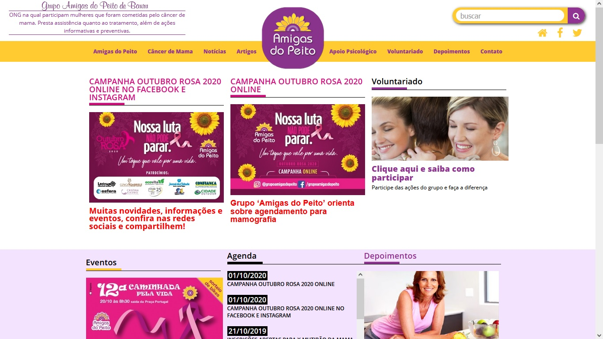

# Amigas Do Peito
Site responsivo de uma ONG, adaptado por MQJogos,
desenvolvido com 31.7% de elementos HTML, 59.3% de variáveis CSS e 
9.0% de práticas JavaScript.
#
<h1>Animação</h1>

#
https://www.youtube.com/watch?v=wvu37Ze0HmE&list=PLSJxovi1IyDGkHNqlrPSU2kXu1aophIkG&index=7
#
#
https://github.com/codewithsadee/youdemi
#
#

